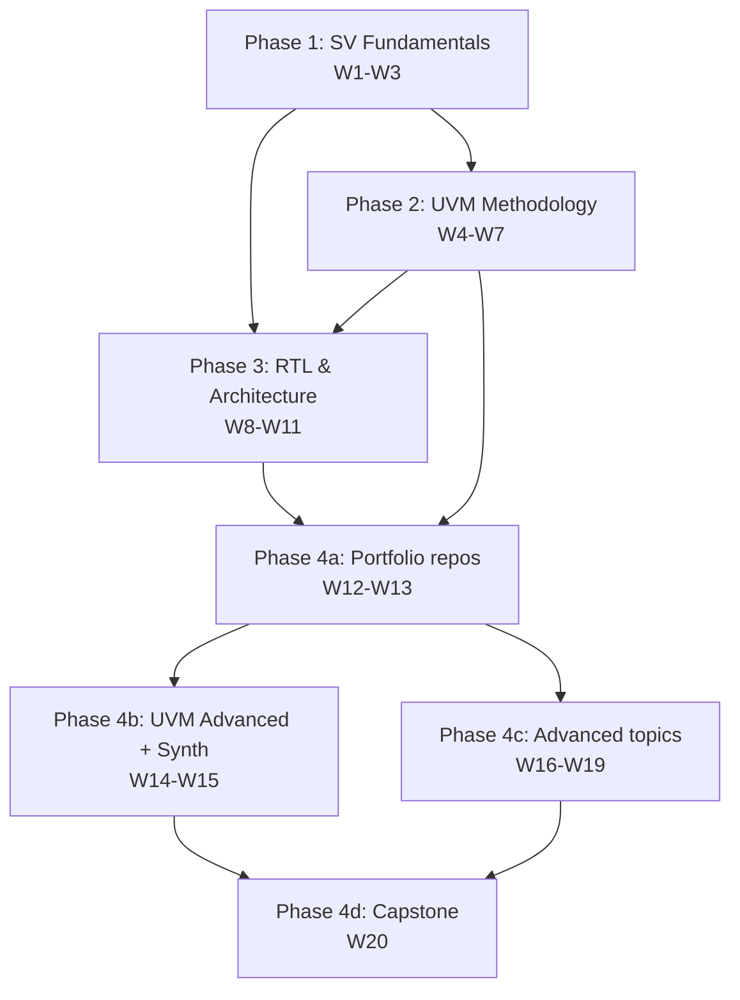

# Roadmap — 4 Phases × 20 Weeks

The high-level dependency graph. Use this when deciding what to study
next, or when a recruiter asks "what's the structure of your study
plan?"

---

## Phase DAG (mermaid)

---

## Three tracks (verification, design, career)

| Week | Verification track | Design track | Career track |
|---|---|---|---|
| W1 | OOP foundations | (small DUTs) | LinkedIn headline draft |
| W2 | CRV | Counter, Sync FIFO | LinkedIn headline iterate |
| W3 | Coverage + SVA | FSMs, arbiter, shift reg | Resume bullet — Phase 1 |
| W4 | UVM arch (Salemi 9–14) | ALU, adders, multiplier, barrel shifter | STAR — UVM bug story |
| W5 | UVM TLM (Salemi 15–19) | Pipelined MAC, RR arbiter | LinkedIn — UVM milestone |
| W6 | UVM stimulus (Salemi 20–23) | Dual-port RAM, async FIFO theory | Elevator pitch — UVM agent |
| W7 | UVM full integration | Async FIFO RTL, CDC | Resume bullet — UVM env |
| W8 | (light) | RISC-V single-cycle CPU | LinkedIn — RISC-V learning |
| W9 | (light) | RISC-V pipeline + hazards | Mock interview — pipeline hazards |
| W10 | UART verification | UART TX/RX | LinkedIn — UART project |
| W11 | SPI/AXI verification | SPI master + AXI-Lite slave | Resume bullet — protocols |
| W12 | **Portfolio: UART-UVM** | UART RTL polish | Demo video script — UART-UVM |
| W13 | **Portfolio: FIFO-UVM + RISC-V** | FIFO + CPU polish | Resume bullets — both projects |
| W14 | RAL + multi-UVC | (small reg block) | Mock interview — RAL/UVC |
| W15 | (light) | Synthesis + PPA + FPGA | Resume bullet — synthesis flow |
| W16 | Q-format MAC TB | Q4.12 saturating MAC 🆕 | LinkedIn — fixed-point post |
| W17 | FIR golden-vector TB | 8-tap FIR streaming 🆕 | Demo video — FIR impulse |
| W18 | Image-conv PGM TB | 3×3 2D convolution 🆕 | LinkedIn — DSP-on-FPGA post |
| W19 | CDC SVA bundle | 4-phase handshake + multi-ratio FIFOs 🆕 | Mock interview — CDC depth |
| W20 | **Capstone: multi-UVC + RAL** | SoC-lite top + synth report 🆕 | Final PORTFOLIO.md + job-search sprint |

🆕 = new in plan 2.0 vs the 15-week beta.

---

## Hard prerequisites

| Week | Cannot start until |
|---|---|
| W4 | W1, W2, W3 — UVM presupposes OOP/CRV/coverage. |
| W7 | W4, W5, W6 — full integration depends on all UVM ingredients. |
| W8 | None within plan; HDLBits-level Verilog is prereq. |
| W9 | W8 — pipeline builds on single-cycle. |
| W10 | W3 (FSMs) and Phase 2 (verif env basics). |
| W11 | W10 (UART FSM patterns) and W3 (FSMs). |
| W12 | W4–W11 — portfolio integrates everything taught so far. |
| W13 | W2 (sync FIFO), W7 (async FIFO), W8–W9 (CPU). |
| W14 | W4–W7 (full UVM) and W11 (AXI-Lite, for the adapter). |
| W15 | W11–W13 (synthesis target = portfolio repos). |
| W16 | W2 (CRV), W3 (coverage). |
| W17 | W16 (qmac), W2 (sync FIFO for delay line). |
| W18 | W17 (FIR), W7 (line-buffer FIFOs). |
| W19 | W7 (basic CDC). |
| W20 | W12, W13, W14, W19 — capstone integrates these. |

---

## Soft prerequisites (recommended order, not required)

- **Read Cummings CDC SNUG-2008 once before W7**, again before W19.
- **Read Sutherland Design interfaces ch. before W4** (Yuval's beta cheatsheet `cheatsheets/spear_ch4_interfaces.sv` covers this).
- **Skim the UVM Cookbook agent + scoreboard pages before W7**.
- **Familiarise with Yosys before W15** — `bash run_yosys_rtl.sh` on a W4 adder produces a schematic in seconds and is the easiest first contact.

---

## Milestones

- **End of W3** — Phase 1 complete. You can write a class-based SV TB
  with constraints, coverage, and assertions for any small RTL block.
- **End of W7** — Phase 2 complete. You can build a UVM env from
  scratch, with sequences, monitor, scoreboard, and coverage on a real
  DUT.
- **End of W11** — Phase 3 complete. You have a single-cycle and a
  pipelined RV32I CPU plus three protocol blocks (UART, SPI,
  AXI-Lite).
- **End of W13** — Three portfolio repos published on GitHub:
  UART-UVM, FIFO-UVM, RISC-V-CPU.
- **End of W15** — Synthesis report on at least one portfolio repo.
  Critical-path timing analysis written.
- **End of W18** — DSP track complete (signed MAC, 1D FIR, 2D conv).
- **End of W20** — Graduation: capstone running, `PORTFOLIO.md`
  published, job-search sprint launched.

---

## "You are here" pointer

As of 2026-05-03: **Phase 2, Week 4** — UVM Architecture. Verification
side complete (Salemi ch.9–13 drills committed), design side TODO
(ALU + adders + multiplier + barrel shifter). See
`week_04_uvm_architecture/README.md` for the daily-driver view.
