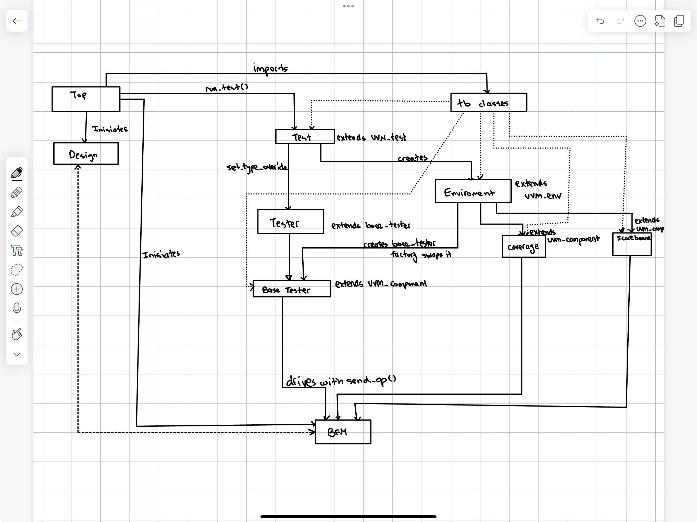

# Verif HW1 — UVM Architecture Diagram ✅

Drew the Salemi ch.13 UVM testbench architecture from memory (no reference).

## What's in the diagram

| Layer | Boxes |
|---|---|
| **Module hierarchy** | `top` instantiates `Design` (DUT) + `BFM` (interface), then calls `run_test()` to launch UVM |
| **TB classes package** | `tb_classes` box (= `tinyalu_pkg`) — all UVM classes live inside it; `top` imports them |
| **uvm_test layer** | `Test` extends `uvm_test`; calls `set_type_override` then `creates` the env |
| **uvm_env layer** | `Environment` extends `uvm_env`; builds 3 children: tester, coverage, scoreboard |
| **uvm_component layer** | `Base Tester` (abstract), `Coverage`, `Scoreboard` — all extend `uvm_component` |
| **Inheritance** | `Tester extends base_tester`; the env asks the factory for a `base_tester` and the override swaps it for the concrete `Tester` |
| **DUT interaction** | `Base Tester` drives the BFM via `send_op()`; `Coverage` + `Scoreboard` observe it; `Design` ↔ `BFM` are wired via ports (dashed line) |

## Key concept demonstrated

The pink/curved arrow labeled `creates base_tester (factory swaps it)` shows the
**factory override pattern**: the `env` always asks for a `base_tester`, and the
test's `set_type_override` redirects that to the concrete `Tester` (random or
add). Same env, different stimulus, picked at test build time.

## Iterations

Drafted three times before settling — each pass tightened a detail
(Design↔BFM port wiring as dashed line, package renamed `tb classes`,
explicit `imports` arrow from `top`).
