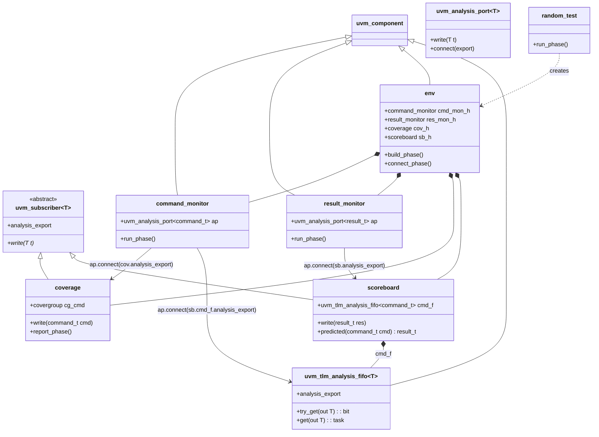

# ch.16 — TinyALU Scoreboard via `uvm_tlm_analysis_fifo`

The chapter introduces the **canonical UVM scoreboard pattern**: one
component that consumes two analysis streams of different types, pairs
them, and compares against a reference model. This note maps the whole
methodology before you write a line of homework code.

## Why ch.16 is different from ch.15

| | ch.15 (dice) | ch.16 (TinyALU) |
|---|---|---|
| Producers | 1 (`dice_roller`) | 2 (`command_monitor`, `result_monitor`) |
| Consumers | 3 | 2 (`scoreboard`, `coverage`) |
| Transaction types | 1 (`int`) | 2 (`command_t`, `result_t`) |
| Pattern | one-to-many broadcast | two-stream pairing |
| Key new primitive | none | `uvm_tlm_analysis_fifo #(T)` |

The scoreboard is a `uvm_subscriber #(result_t)` *and* holds a
`uvm_tlm_analysis_fifo #(command_t)` field. **Two inputs into one
component, two different types** — that's the new shape.

## Class diagram (UML)



The three arrows at the bottom are the **three `connect()` calls in
`env::connect_phase`**. Memorise that picture — it's the whole wiring.

## Data flow at run time

```
                                                                  ┌────────┐
                                                              ┌──>│coverage│ (covers cmd)
                                                              │   └────────┘
              cmd                                             │
   ┌────────────────────┐    ap.write(cmd)    ┌───────────────┴─────┐
   │  command_monitor   │ ──────────────────> │ command stream      │
   └────────────────────┘                     │  (cmd_t broadcasts) │
                                              └───────────────┬─────┘
                                                              │
                                                              ▼
                                                  ┌────────────────────────┐
                                                  │ scoreboard.cmd_f       │
                                                  │ (uvm_tlm_analysis_fifo)│
                                                  │   queue of command_t   │
                                                  └─────────┬──────────────┘
                                                            │ try_get(cmd)
              res                                           │
   ┌────────────────────┐    ap.write(res)                  ▼
   │   result_monitor   │ ──────────────────> ┌───────────────────────┐
   └────────────────────┘                     │ scoreboard.write(res) │
                                              │   1. try_get cmd      │
                                              │   2. exp = predicted  │
                                              │   3. compare exp vs r │
                                              │   4. uvm_error on miss│
                                              └───────────────────────┘
```

**The asymmetry is the point.** Both monitors call `.write()` on their
analysis ports, but:

- The **command stream** has *two* destinations:
  - `coverage.analysis_export` — direct, immediate write.
  - `scoreboard.cmd_f.analysis_export` — goes into a queue.
- The **result stream** has *one* destination:
  - `scoreboard.analysis_export` — calls `scoreboard.write(result)`,
    which then pulls a queued command via `cmd_f.try_get(cmd)` to pair it.

The fifo decouples timing: commands accumulate in `cmd_f` until the
matching result arrives. The pairing is **first-in-first-out** — the
oldest queued command pairs with the next observed result. This works
for in-order pipelines (TinyALU is in-order). For out-of-order DUTs
you'd switch to an associative-array map keyed on transaction ID.

## Phase-by-phase skeleton (industry-standard)

```systemverilog
// command_monitor — same shape as a uvm_monitor publisher
class command_monitor extends uvm_component;
    `uvm_component_utils(command_monitor)
    uvm_analysis_port #(command_t) ap;
    virtual tinyalu_bfm bfm;

    function void build_phase(uvm_phase phase);
        super.build_phase(phase);
        ap = new("ap", this);
        // get bfm from config_db
    endfunction

    task run_phase(uvm_phase phase);
        command_t cmd;
        forever begin
            bfm.wait_for_command(cmd);
            ap.write(cmd);
        end
    endtask
endclass
```

```systemverilog
// scoreboard — the new pattern
class scoreboard extends uvm_subscriber #(result_t);
    `uvm_component_utils(scoreboard)
    uvm_tlm_analysis_fifo #(command_t) cmd_f;     // ← second input

    function void build_phase(uvm_phase phase);
        super.build_phase(phase);
        cmd_f = new("cmd_f", this);               // ← MUST construct
    endfunction

    function result_t predicted(command_t cmd);
        // reference model: spec-driven expected output
    endfunction

    function void write(result_t actual);         // result-stream entry
        command_t cmd;
        result_t  expected;
        if (!cmd_f.try_get(cmd))
            `uvm_fatal("SB", "result without matching command in fifo")
        expected = predicted(cmd);
        if (actual !== expected)
            `uvm_error("SB", $sformatf("op=%s a=%0d b=%0d  exp=%0d  got=%0d",
                                       cmd.op.name(), cmd.a, cmd.b, expected, actual))
    endfunction
endclass
```

```systemverilog
// env — three connect() calls and you're done
function void env::connect_phase(uvm_phase phase);
    super.connect_phase(phase);
    cmd_mon_h.ap.connect(cov_h.analysis_export);          // cmd → coverage
    cmd_mon_h.ap.connect(sb_h.cmd_f.analysis_export);     // cmd → scoreboard fifo
    res_mon_h.ap.connect(sb_h.analysis_export);           // res → scoreboard write
endfunction
```

## Pitfalls specific to ch.16

| Pitfall | Symptom |
|---|---|
| Forgot `cmd_f = new(...)` in scoreboard's `build_phase` | null-pointer fatal on first command write |
| Used `get()` (blocking task) inside `write()` | compile error — `write` is a function, can't call tasks |
| Connected `result_monitor.ap` to `scoreboard.cmd_f.analysis_export` | type mismatch (result_t vs command_t) — caught at elaboration |
| Connected `command_monitor.ap` to `scoreboard.analysis_export` directly | scoreboard's `write(result_t)` gets called with a `command_t` — type mismatch caught at elab |
| Order-mismatch on out-of-order DUT | fifo pairs wrong cmd with wrong result; switch to ID-keyed assoc-array |
| `cmd_f.try_get` returned 0 silently | scoreboard saw a result with no matching command — fatal it loudly |
| `predicted()` mutates `cmd` | covergroup downstream sees the mutation if cmd was passed by ref; clone first |
| Two scoreboards share one `cmd_f` instance | ownership is wrong; each scoreboard owns its own fifo |

## What to verify in the homework

1. Every transaction observed by `command_monitor` reaches *both* the
   coverage subscriber **and** the scoreboard's fifo.
2. Every result is paired with a command (no `\`uvm_fatal` from the
   "result without matching command" check).
3. The reference model in `predicted()` matches the DUT spec for at
   least all five ops (ADD/SUB/AND/OR/XOR).
4. Coverage hits all op codes and operand corners (0, max, mid).
5. Pass criterion: `UVM_ERROR + UVM_FATAL == 0` and a printed banner.

## Cross-links

- `[[../../../../../docs/concepts/uvm_tlm_analysis_fifo|uvm_tlm_analysis_fifo]]` — the primitive's full reference.
- `[[../../../../../docs/concepts/uvm_analysis_ports|uvm_analysis_ports]]` — predictor / pass-through patterns building on this.
- `[[../../../../../docs/concepts/uvm_scoreboard|uvm_scoreboard]]` — the role this drill instantiates.
- Salemi *UVM Primer* ch.16 *Analysis Ports in the Testbench*, pp. 106–114.
